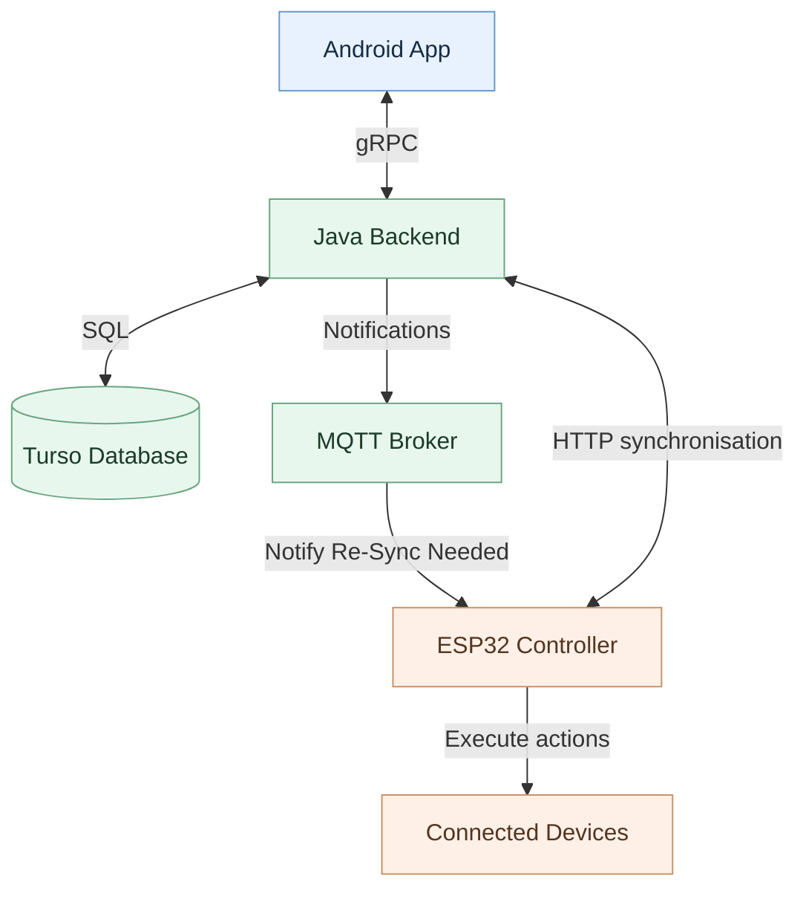

# Alarm System

A device-agnostic IoT alarm and scheduling system. An Android app allows users to configure alarms consisting of multiple phases, each containing actions for connected devices. A Java backend persists and distributes schedules, while controllers such as an ESP32 schedule and execute actions on physical devices.

A shared Protocol Buffers schema defines alarms, devices, capabilities and API messages, enabling communication between components written in different languages.

## Components

| Path | Role | Technology |
| --- | --- | --- |
| `app/` | Android client | Android, Gradle |
| `server/` | Java backend | Java 21, Gradle |
| `proto/` | Shared Protobuf schema and generated Java/gRPC/nanopb code | Protocol Buffers, Gradle |
| `database/` | Relational schema for controllers, devices, capabilities, alarms and actions | SQL, Turso (libSQL) |
| `repos/java/` | Shared Java repository code | Java, Gradle |
| `repos/android/` | Legacy Android repository implementation (local caching planned) | Android, Gradle |
| `repos/grpc/` | gRPC client/repository integration | Java, gRPC, Gradle |
| `repos/server/` | Server-side repositories providing database persistence | Java, Turso, Gradle |
| `controller/esp32/` | Embedded controller | C++, PlatformIO, nanopb |

## Getting started

See [development and build instructions](docs/development.md) for commands, prerequisites and known limitations.

For component-specific instructions:
- [Android app](app/README.md)
- [Server](server/README.md)
- [Shared Protobuf](proto/README.md)

## Architecture at a glance

Components share a Protocol Buffers schema, with Java/gRPC code generated for the app and server, and nanopb code generated for the ESP32.

Controllers host devices, but scheduled actions refer to *device identities*, rather than binding each alarm permanently to a particular controller. This is intended to allow a device to move between controllers without rewriting its alarms.

The database preserves these relationships through foreign-key constraints. It uses a relational structure for devices, capabilities and schedules, with JSON fields for variable action parameters and their requirements.

## Configuration and security

Keep local secrets out of version control. The root `.env` is ignored by the project's `.gitignore`; never copy live secrets into README examples. Inspect `server/build.gradle` to understand the local server `run` task's `.env` parser. Gradle's environment variable injection does not automatically apply to Docker or Cloud Run.

---

*Note: Generative AI was used to aid the development of this document.*