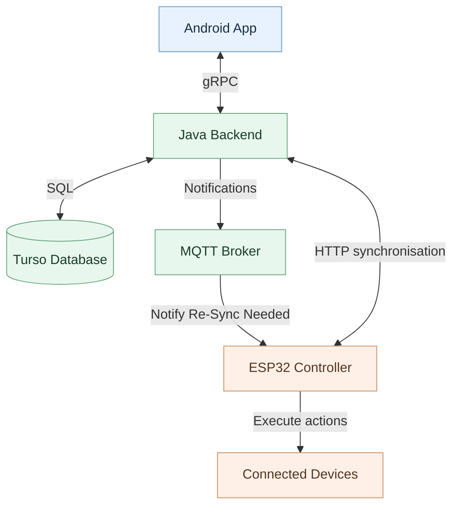

# Alarm System

This project is a device-agnostic IoT alarm and scheduling project. An Android app is used to configure alarms that comprise of device actions at multiple times and phases; a Java backend persists and distributes schedules; Controllers such as an ESP32 schedule and execute actions on physical devices. A Shared Protocol Buffers define schedules, devices, capabilities and API messages to allow for a language agnostic shared message.# Alarm System

## Components

| Path | Role | Build tooling |
| --- | --- | --- |
| `app/` | Android client | Android Gradle plugin, Gradle |
| `server/` | Java backend | Java 21, Gradle |
| `proto/` | Shared Protobuf schema and generated Java/gRPC/nanopb code | Gradle, protoc |
| `repos/java/` | Shared Java repository code | Gradle |
| `repos/android/` | Legacy Android repository implementation (planned local caching)| Gradle |
| `repos/grpc/` | gRPC client/repository integration | Gradle |
| `repos/server/` | Server-side repositories (Turso Database communication) | Gradle |
| `controller/esp32/` | Embedded controller | PlatformIO, C++, nanopb |

## Getting started

See [development and build instructions](docs/development.md) for commands, prerequisites and known limitations.

For component-specific instructions:
- [Android app](app/README.md)
- [Server](server/README.md)
- [Shared Protobuf](proto/README.md)

## Architecture at a glance

Components share a Protocol Buffers schema, with Java/gRPC code generated for the app and server, and nanopb code generated for the ESP32.

Controllers host devices, but scheduled actions refer to *device identities*, rather than binding each alarm permanently to a particular controller. This is intended to allow a device to move between controllers without rewriting its alarms.

## Configuration and security

Keep local secrets out of version control. The root `.env` is ignored by the project's `.gitignore`; never copy live secrets into README examples. Inspect `server/build.gradle` to understand the local server `run` task's simple `.env` parser. Do not assume that Gradle's `.env` injection also applies to Docker or Cloud Run.

---

*Note: Generative Ai was used to aid the development of this document*
